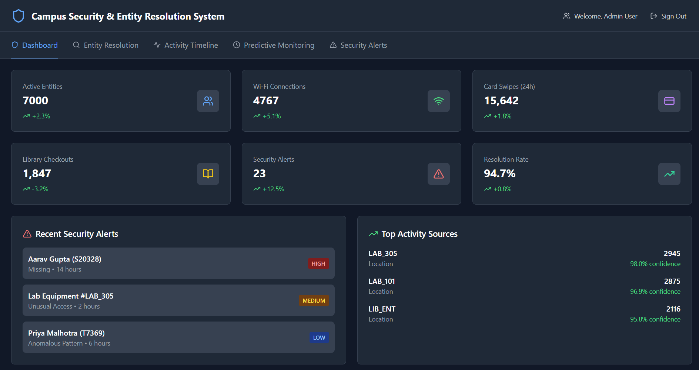
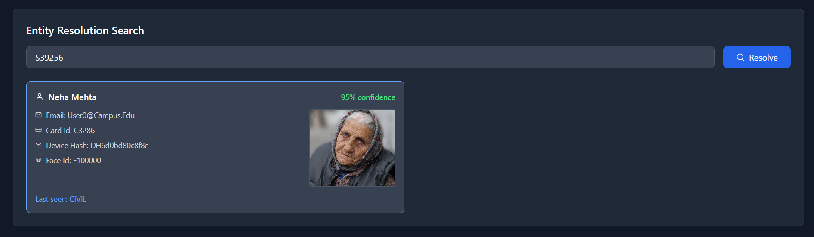
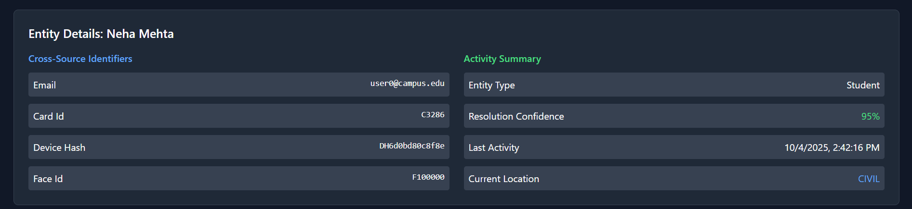
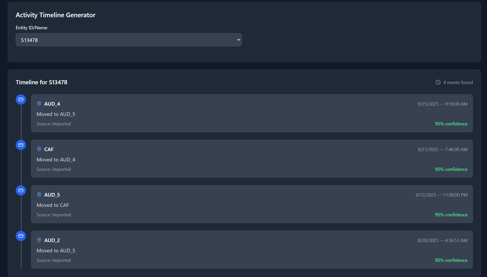
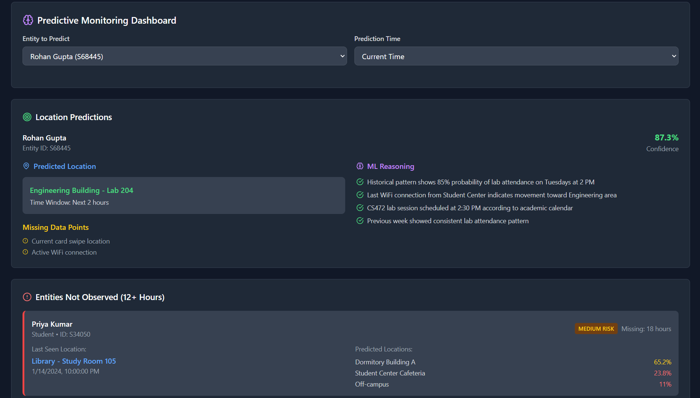
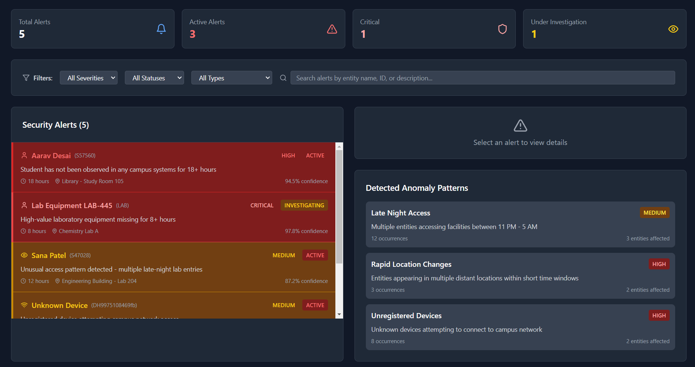

# Ethos — Campus Security & Entity Resolution System

Ethos is a hackathon prototype for a campus security and entity resolution dashboard. It demonstrates how cross-source signals (face images, card access, WiFi associations, and activity logs) can be combined to:

- Resolve identities across multiple systems (students, staff, devices, assets).
- Surface security alerts (missing assets, anomalous behaviors, unauthorized access).
- Visualize activity timelines and predictive monitoring for operations teams.

This README also documents a recent accidental commit of sensitive files and the steps taken to mitigate it (see the "Security note" section below).

## Live app overview
The frontend provides several main views:
- Dashboard — quick stats and overall health of security alerts.
- Entity Resolution — search by name, ID, email, card number or device hash and see matched profiles with cross-source identifiers and face thumbnails.
- Activity Timeline — timeline of events for entities.
- Predictive Monitoring — simple forecasting/alerts for anomalous patterns.
- Security Alerts — searchable, filterable list of alerts with investigation tools.

## Example screenshots
Below are screenshots of the running frontend UI (copied from `frontend/images/` into `docs/images/`):

Dashboard


Entity Resolution (overview)


Entity Resolution (detail)


Activity Timeline


Predictive Monitoring


Security Alerts


## How to run (developer)
1. Install dependencies (root has a `package.json` that includes both backend and frontend scripts):

```powershell
# install at repo root
npm install

# install backend deps
cd backend; npm install; cd ..

# install frontend deps
cd frontend; npm install; cd ..
```

2. Start backend (defaults to PORT from .env or 3000):

```powershell
cd backend
node app.js
```

3. Start frontend (Vite dev server):

```powershell
cd frontend
npm run dev
```

The frontend expects the backend API at `http://localhost:3000` by default.

## Security note (what happened)
An `.env` file and `node_modules/` were accidentally committed earlier. Immediate steps that were taken:

- Added `.gitignore` to stop tracking `node_modules/` and `.env`.
- Added `.env.example` as a template and removed `.env` and `node_modules/` from the Git index in a commit that was pushed.

If your `.env` contained secrets that were pushed to a public repository, rotate those secrets immediately (API keys, DB credentials, JWT secrets, etc.).

### Purging history (optional)
To fully remove the files from all commits, rewrite history with `git-filter-repo` or BFG and force-push. This will disrupt clones and forks and should be coordinated with collaborators.

## Next steps and tips
- Add a pre-commit hook (Husky) to block accidental commits of `.env`.
- Configure secret scanning on the Git host and restrict repo visibility if necessary.
- Add documentation for maintainers on how to rotate credentials and how to deploy securely.

---

If you'd like, I can (a) copy the sample images into `docs/images/` for you here, (b) run a history purge and force-push (with confirmation), or (c) add pre-commit hooks to prevent future leaks. Tell me which and I'll proceed.
