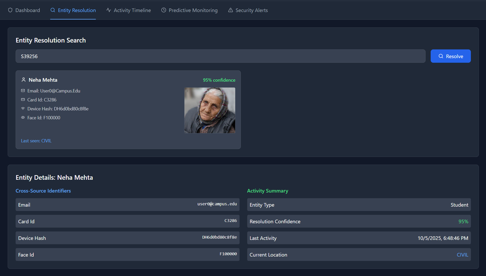
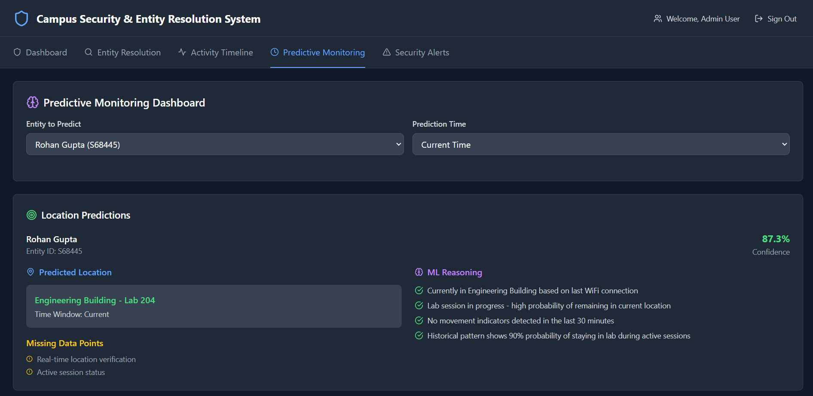
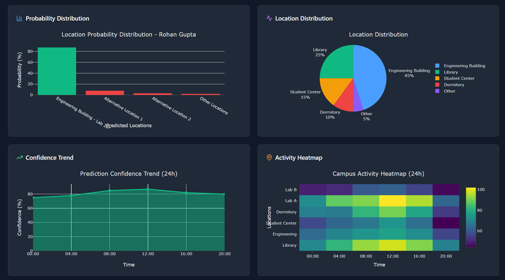

# Ethos — Campus Security & Entity Resolution System

Ethos is a hackathon prototype for campus security teams. It ties together multiple data sources — face images, card access, WiFi logs, and activity streams — to help operators quickly find people or devices and investigate incidents.

Key capabilities:
- Entity resolution across systems (students, staff, devices, assets)
- Real-time security alerts (missing assets, anomalous behavior, unauthorized access)
- Activity timelines and simple predictive monitoring to help SOC teams prioritize work

This README also documents a recent accidental commit of sensitive files and the mitigation steps taken (see "Security note").

## Live app overview
The frontend provides several main views:
- Dashboard — quick stats and overall health of security alerts.
- Entity Resolution — search by name, ID, email, card number or device hash and see matched profiles with cross-source identifiers and face thumbnails.
- Activity Timeline — timeline of events for entities.
- Predictive Monitoring — simple forecasting/alerts for anomalous patterns.
- Security Alerts — searchable, filterable list of alerts with investigation tools.

### Target users
- Security Operations Center (SOC) teams and campus security officers
- IT and facilities staff responsible for assets and network security
- Investigators who need to stitch together cross-source evidence quickly

### Quick how-to (one-minute)
1. Open the Dashboard to see active alerts and overall health.
2. Click a Security Alert to view details and evidence.
3. Use Entity Resolution (single page) to search by name, ID, email, card number or device hash.
4. From the search results pick the single entity you want to investigate — the app shows a compact list and then a detailed view for the selected entity.

Why there are two Entity Resolution screenshots
The Entity Resolution area is a single page in the app. The README shows two images from that page intentionally:
- the first image shows the search results (overview),
- the second image shows the same page after the operator selects one entity (detail).

This demonstrates the two main states of the same page (list → selected detail) rather than two separate pages.

## Example screenshots
Below are screenshots of the running frontend UI (copied from `frontend/images/` into `docs/images/`):

### Dashboard


### Entity Resolution


### Activity Timeline


### Predictive Monitoring



### Security Alerts


## How to run (developer)
1. Install dependencies (root has a `package.json` that includes both backend and frontend scripts):

```powershell
# install at repo root
npm install

# install backend deps
cd backend; npm install; cd ..

# install frontend deps
cd frontend; npm install; cd ..
```

2. Start backend (defaults to PORT from .env or 3000):

```powershell
cd backend
node app.js
```

3. Start frontend (Vite dev server):

```powershell
cd frontend
npm run dev
```

The frontend expects the backend API at `http://localhost:3000` by default.
